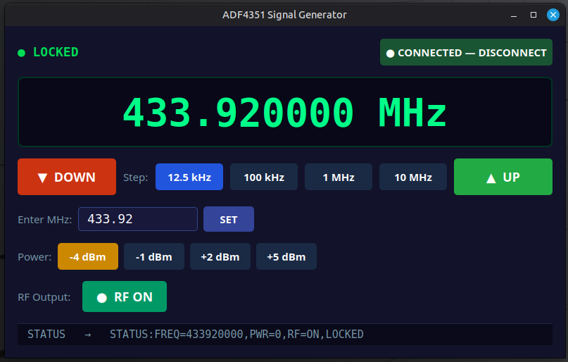

# ADF4351 Signal Generator

Wideband RF signal generator covering **144 MHz – 1.3 GHz** (hardware capable of 35–4400 MHz).

An ADF4351 PLL synthesiser module is controlled by a Raspberry Pi Pico 2W over bit-banged SPI.
The Pico exposes a simple USB serial command protocol; a PyQt5 desktop GUI on Linux provides
frequency tuning, power control, and live lock-detect monitoring.



---

## Hardware

| Component              | Notes                                                  |
|------------------------|--------------------------------------------------------|
| ADF4351 breakout       | Common eBay/AliExpress module with onboard loop filter |
| Raspberry Pi Pico 2W   | RP2350, MicroPython, USB CDC serial                    |
| 25 MHz TCXO (±1 ppm)  | Replaces onboard crystal — essential for stability     |
| Separate 5 V PSU       | Powers the ADF4351 board; do not use Pico's 5 V pin   |

### Wiring

| Pico GPIO        | Pico pin | ADF4351 header | ADF4351 pin | Notes                             |
|------------------|----------|----------------|-------------|-----------------------------------|
| GP2 (SPI0 SCK)   | 4        | CLK            | 4           | SPI clock                         |
| GP3 (SPI0 TX)    | 5        | DAT            | 5           | SPI data                          |
| GP4 (GPIO out)   | 6        | LE             | 6           | Latch enable, toggled by firmware |
| GP5 (GPIO out)   | 7        | CE             | 8           | Pull HIGH to enable chip          |
| GP6 (GPIO in)    | 9        | LD             | 2           | Lock detect input                 |
| GND              | 38       | GND            | 10          |                                   |
| 3V3              | 36       | PDR            | 1           | Tie PDR high to keep chip running |
| —                | —        | VCC            | —           | Separate 5 V supply               |

---

## Repository Layout

```
pico/
└── main.py          MicroPython firmware — SPI driver + USB serial command loop
desktop/
└── siggen_gui.py    PyQt5 GUI for Linux
docs/
└── playbook.md      Full build/setup guide, troubleshooting, PLL parameters
```

---

## Firmware

Flash to the Pico 2W with [mpremote](https://docs.micropython.org/en/latest/reference/mpremote.html):

```bash
sudo mpremote cp pico/main.py :main.py
sudo mpremote reset
```

### Serial command set

Commands are newline-terminated ASCII, case-insensitive.

| Command        | Example              | Response                              |
|----------------|----------------------|---------------------------------------|
| `FREQ:<hz>`    | `FREQ:446100000`     | `OK:LOCKED` / `OK:UNLOCKED`           |
| `PWR:<0-3>`    | `PWR:3`              | `OK:…`  (0=−4, 1=−1, 2=+2, 3=+5 dBm) |
| `RF:ON\|OFF`   | `RF:ON`              | `OK:…`                                |
| `STATUS`       | `STATUS`             | `STATUS:FREQ=…,PWR=…,RF=…,LOCKED\|UNLOCKED` |

Test interactively:

```bash
sudo mpremote repl
```

---

## Desktop GUI

Requires Python 3.12, PyQt5, and pyserial.

```bash
# One-time setup
sudo apt install python3.12-venv python3-pyqt5
python3 -m venv --system-site-packages .venv
.venv/bin/pip install pyserial

# Run
source .venv/bin/activate
python desktop/siggen_gui.py
```

User must be in the `dialout` group to access `/dev/ttyACM0` without sudo:

```bash
sudo usermod -aG dialout $USER   # log out and back in after
```

### GUI features

- Large MHz frequency display
- Step tuning: 12.5 kHz / 100 kHz / 1 MHz / 10 MHz
- Direct MHz entry field
- Output power selector (−4 / −1 / +2 / +5 dBm)
- RF on/off toggle
- Live lock-detect indicator (polls every 2 s)
- Status bar showing every command and response

---

## PLL notes

- Reference: 25 MHz TCXO, R = 1 → PFD = 25 MHz
- Modulus: 2000 → minimum step = 12.5 kHz
- VCO range: 2200–4400 MHz; output divider ÷1 … ÷64
- 8/9 prescaler requires INT ≥ 75 (limits minimum output to ~34 MHz)
- Without a TCXO, expect ±20–50 ppm drift with temperature (±9–22 kHz at 446 MHz)

---

## License

MIT
